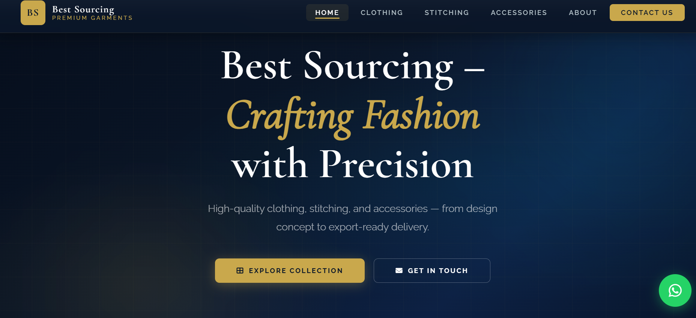
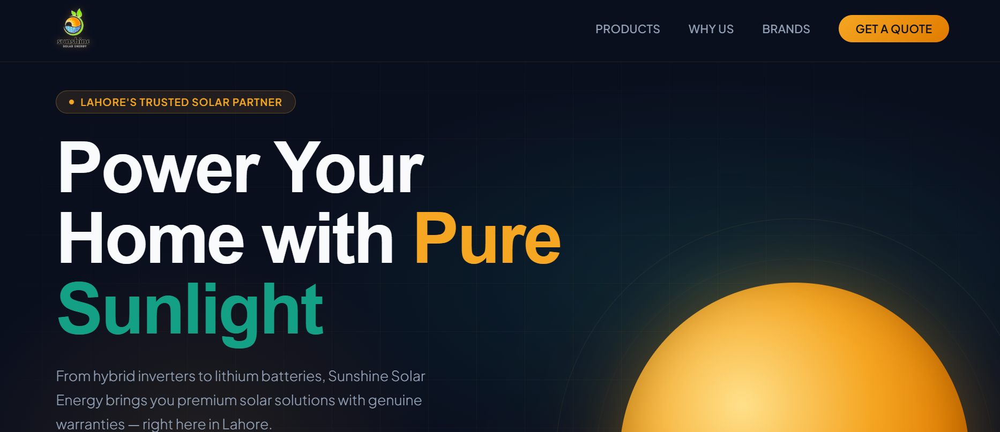

 

  

  

---

## 👨‍💻 WHO AM I?

### Hi, I'm Muhammad Faizan 👋

**Data Science Student • Web Developer • Software Developer**

I love turning ideas into real-world software and continuously improving my development skills.

🎓 **BS Data Science** — COMSATS University Islamabad, Lahore Campus

💻 Focused on **Web Development, Software Development, Java, Python & JavaScript**

🚀 Exploring **AI, Automation & Modern Software Development**

---

## ⚡ Tech Stack

---

## 🚀 Featured Work

<table>
<tr>

<td width="33%" align="center">

  

<b>WSU Consultant</b>

  

Education & Study Abroad Consultancy Website.

  

</td>

<td width="33%" align="center">

  

<b>Best Sourcing</b>

  

Premium garments sourcing website with modern UI.

  

</td>

<td width="33%" align="center">

  

<b>Sunshine Solar</b>

  

Modern solar business website with professional design.

  

</td>

</tr>
</table>

---

## 🌐 Let's Connect

<table>
<tr>

<td align="center" width="16.66%">

</td>

<td align="center" width="16.66%">

</td>

<td align="center" width="16.66%">

</td>

<td align="center" width="16.66%">

</td>

<td align="center" width="16.66%">

</td>

<td align="center" width="16.66%">

</td>

</tr>
</table>

 

---

  

